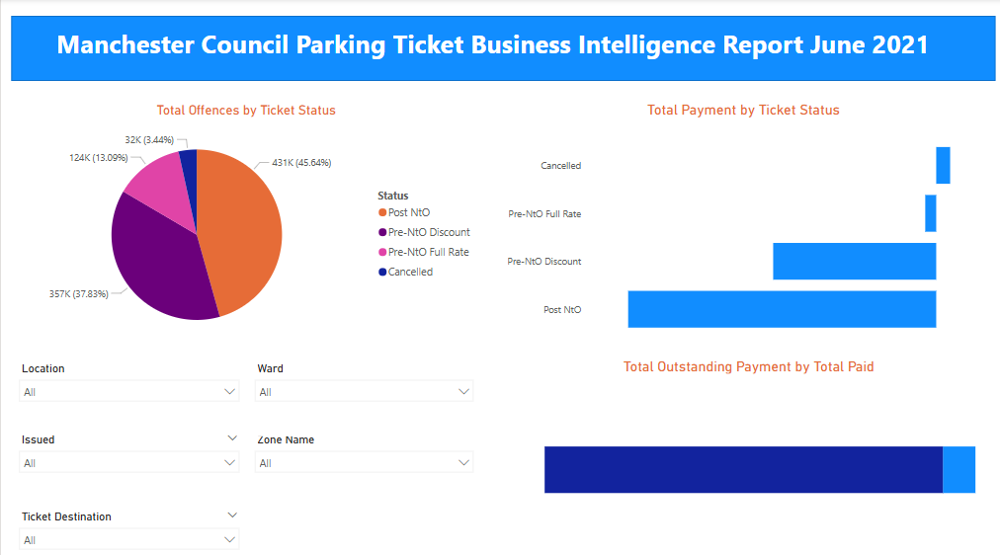

# Data Analysis Project 
# Project 1
**Title:** [Udemy Interactive Sales Performance Dashboard](https://github.com/Phatiks/Phatiks.github.io/blob/main/udemy_online_education_courses_dataset.xlsx)

**Tools Used:** Microsoft Excel (Pivot Tables, Pivot Charts, Conditional formatting, Slicers)

**Project Description:**
This project involved analysing course subscription data of Udemy Online Educational Platform to identify trends and patterns in sales performance for 2020. It is designed to provide a comprehensive overview of key performance metrics. This dashboard allows stakeholders to easily monitor and analyse the company’s performance across different course titles & subject, subscriptions, and training levels. The dashboard includes the following features:

Total Price by Subject: Visual representation of course prices allocated by subjects to determine proper pricing for courses.
Total Subscribers by Payment: A visual insight to determine how many subscribers paid/not paid per subject to know which of the subject will need optimization.
Total Reviews by Subject: Displays the reviews given to each subject by subscribers to determine their thoughts on the course/subject impact.
Total Subscription by Levels: Highlights the total number of individuals that subscribe by levels of the courses to determine level improvements.
Total Duration by Lectures: Displays the content length of each course by lectures given and if contents need to revamp or not.
Total Paid by Levels: Indicates the payment made by subscribers for each course levels.

Additionally, the dashboard includes interactive slicers and timeline for:
Subject: Filter the data to view performance for a specific subject.
Paid: Focus on payment made for courses/subject to analyse profitability.
Levels: Drill down into the performance of each courses/subject per levels.
Course Title: Drill down into the performance of individual courses.

**Key findings:**
Subject Profitability: Identified the most profitable subject and highlighted subject where performance could be improved.
Course Level Trends: Revealed patterns in subscription and profit that correspond with course/subject levels, allowing for more strategic planning.
Top-Performing subject: Highlighted which subject are driving the most revenue and profit, to aid marketing decisions.
Training time Volatility: Analysed course timings by lectures to understand buy-in from subscribers and adjust business strategies accordingly.
This dashboard serves as a crucial tool for the Udemy Online Educational Platform management team, providing clear, actionable insights that drive informed decision-making and strategic planning.

**Dashboard Overview:**

# Project 2

**Title**: Manchester Council Parking Ticket Business Intellignece Data
  
**SQL Code:** [Manchester Council Parking Ticket Fines Data Queries](https://github.com/Phatiks/Phatiks.github.io/blob/main/Manchester%20Council%20Parking%20Ticket%20Fines.sql)

**SQL Skills Used:** 
1. Data Retrieval (SELECT): Queried and extracted specific information from the database.
2. Data Aggregation (SUM, COUNT): Calculated totals, such as total payment of tickets and outstandings, and counted records to analyze data trends.
3. Data Filtering (WHERE, BETWEEN, IN, AND): Applied filters to select relevant data, including filtering by ranges and lists.
4. Data Source Specification (FROM): Specified the tables used as data sources for retrieval
 

**Project Description:**
This project involved analysing the Parking Ticket fines issued by Manchester Council to identify trends and patterns in the revenue generated for June 2021. It is designed to provide a comprehensive overview of key performance metrics. This dashboard allows stakeholders to easily monitor and analyse the Council’s Tax Force performance across different regions, wards, and time periods. The dashboard includes the following features:

Total Offence by Ticket Status: Visual representation of parking offences by the type of ticket issued to the offender.
Total Payment by Ticket Status: Displays the payment made by offenders depending on the type of ticket issued providing insights into revenue generated over time.
Total Outstanding Payment by Total paid: Displays the outstanding payment from offenders compared to those that have paid, allowing for easy comparison of profitability throughout the month.

Additionally, the dashboard includes interactive slicers and timeline for:
Location: Filter the data to view performance for a specific location.
Issued: Focus on the day’s fines were issued to determine days of the week parking offences are more made.
Ward: Drill down into the ward that contribute more in parking offences.
Zones: Drill down into the zones to determine each zones contribution in traffic offences.

**Technology used:** SQL server

**Dashboard Overview:**

 
