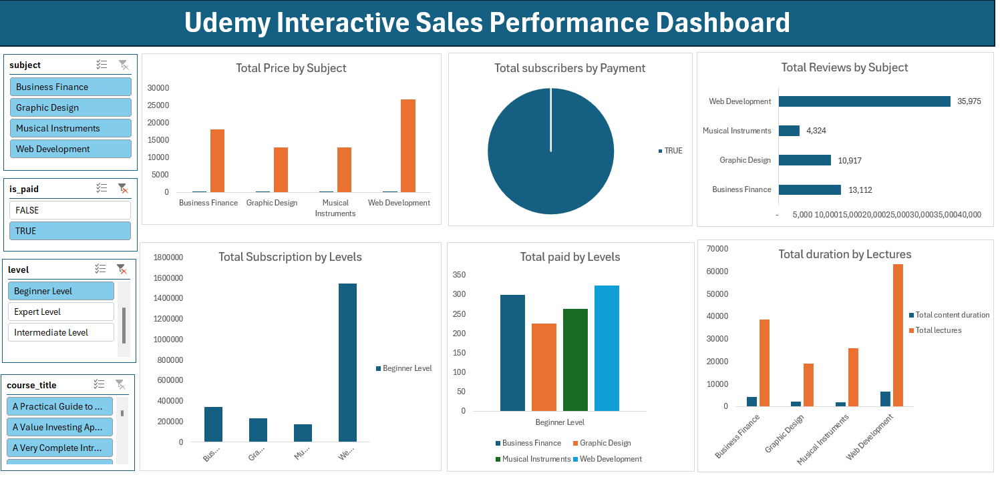

# Data Analysis Project 
# Project 1
**Title:** [Udemy Interactive Sales Performance Dashboard](https://github.com/Phatiks/Phatiks.github.io/blob/main/udemy_online_education_courses_dataset.xlsx)

**Tools Used:** Microsoft Excel (Pivot Tables, Pivot Charts, Conditional formatting, Slicers)

**Project Description:** 
 

**Key findings:**

**Dashboard Overview:**

# Project 2

**Title:** Employee Data

**SQL Code:** [Emloyee data queries](https://github.com/Phatiks/Phatiks.github.io/blob/main/employee.sql)

**SQL Skills Used:** 
1. Data Retrieval (SELECT): Queried and extracted specific information from the database.
2. Data Aggregation (SUM, COUNT): Calculated totals, such as sales and quantities, and counted records to analyze data trends.
3. Data Filtering (WHERE, BETWEEN, IN, AND): Applied filters to select relevant data, including filtering by ranges and lists.
4. Data Source Specification (FROM): Specified the tables used as data sources for retrieval
 

**Project Description:**

**Technology used:** SQL server
 
