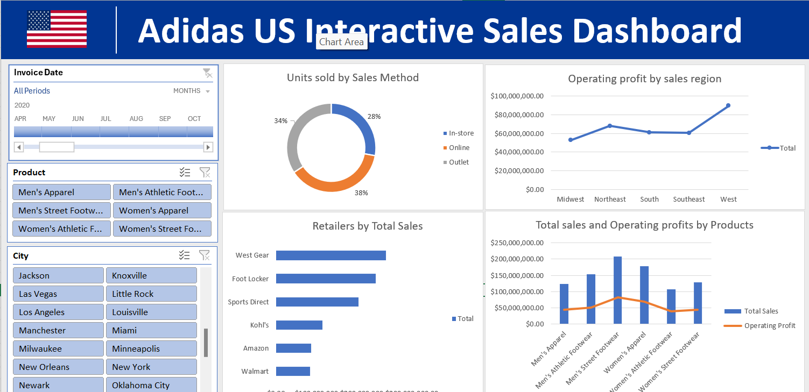

# Data Analysis Project 
# Project 1
**Title:** [Udemy Interactive Sales Performance Dashboard](https://github.com/Phatiks/Phatiks.github.io/blob/main/udemy_online_education_courses_dataset.xlsx)

**Tools Used:** Microsoft Excel (Pivot Tables, Pivot Charts, Conditional formatting, Slicers)

**Project Description:** 
 

**Key findings:**

**Dashboard Overview:**

# Project 2
**Title:** [Adidas US Interactive Sales Dashboard](https://github.com/Phatiks/Phatiks.github.io/blob/main/First%20Dashboard.xlsx)

**Tools Used:** Microsoft Excel (Pivot Tables, Pivot Charts, Conditional formatting, Slicers)

**Project Description:** 
 

**Key findings:**

**Dashboard Overview:**

